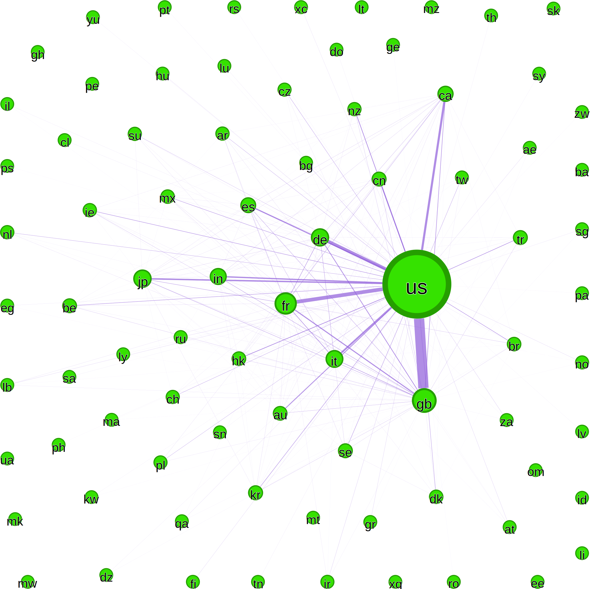

# Required Packages

- networkx
- geopy
- matplotlib
- numpy
- pandas

## Abstract

This paper aims to explore how the inclusion of films from non-mainstream cinema centers, with a particular focus on Brazilian cinema, in the IMDb Top 250 influences the visibility and perception of other productions from similar countries. It examines the impact these films have on user discoverability and the broader global cinema ecosystem. Additionally, the study investigates how a single film can serve as a gateway to others, potentially creating cultural or thematic pathways. Finally, the paper seeks to identify recurring genres, subjects, or themes that are most prevalent among these highly ranked international films.

### Countries Movies Network

### Movies Network

In **February and March of 2025**, the Brazilian internet was flooded with posts about the _2025 Oscars_. On this occasion, _I'm Still Here_, a Brazilian film directed by **Walter Salles**, was nominated for three major awards, including **Best Picture**. By the end of the ceremony, the film had won two of them, once again placing Brazilian cinema in the global spotlight and sparking widespread discussion among cinephiles worldwide.

The success of _I'm Still Here_ not only marked a significant achievement for Brazilian cinema but also reinforced a trend that began with _Parasite_ (2019), directed by **Bong Joon-ho**, which disrupted the historically dominant North American and European film markets.

This dominance is often tied to **language**. According to a study by _Ampere Analysis_, for the first time in history, the viewership of **non-Anglophone content** reached **54%** in 2024 among users who reported watching films “very often” or “sometimes.” This data includes audiences from the **UK**, **USA**, **Australia**, and **Canada**, and represents a sharp increase from 43% in 2020 [Analysis 2024].

Part of the growing popularity of foreign-language films and TV shows can be attributed to the **global reach of streaming platforms** such as **Netflix**, which make international content more accessible than traditional television channels or local cinema circuits.

A study by _GWI_ highlights a notable increase in the consumption of **South Asian**, particularly **South Korean**, content on Netflix [GWI]. This surge can be partly explained by **national media policies**, such as those in South Korea and other countries, that require a minimum percentage of domestically produced content in both cinema screenings and streaming catalogues.

These policies have fostered stronger ties between major distribution platforms like Netflix and local film industries. As a result, streaming services are increasingly investing in international content not only to meet regulatory requirements but also to diversify their global offerings, helping to challenge the dominance of North American and European productions in mainstream media.

In addition to popular streaming services, many people rely on **alternative platforms** to discover what to watch or to search for detailed information about specific films. One of the most widely used platforms for this purpose is **IMDb** (_Internet Movie Database_). On IMDb, users can search for films, explore related titles, and access a wide range of information including cast, crew, reviews, and production details.

Like other online platforms, IMDb incorporates a **user-based rating system**. Notably, it features a widely recognized list known as the **IMDb Top 250** a ranking of the 250 highest-rated films based on user ratings. This list has become a reference point for movie enthusiasts worldwide and plays a significant role in shaping viewing choices and perceptions of film quality.

Movies featured in the **IMDb Top 250** are generally considered outstanding by users who are highly engaged with cinema. The list includes major blockbusters such as _Avengers_ and _Star Wars_, as well as cult and classic films by directors like **Alfred Hitchcock**, **Stanley Kubrick**, and **Akira Kurosawa**. Overall, the Top 250 is diverse in terms of genres, styles, and target audiences.

## Dataset

The dataset used in this study was built using the **IMDb Top 250 films as of May 2025** as the starting point. For each film on the list, relevant information was extracted from the **TMDb API**, including:

- Genres
- Keywords
- Production countries
- Production companies
- Data on cast and crew

Additionally, for every Top 250 film, up to **20 recommended films** were retrieved using the same API.

This process resulted in a dataset containing **2,573 unique titles**, incorporating both the Top 250 and their associated recommendations. The dataset thus provides a broad foundation for examining recommendation relationships across a diverse set of international films.

---

### 4.1. Data Overview

Among the Top 250 films:

- **183** are associated with the **United States** (≈54%)
- **42** with the **United Kingdom** (12%)
- **18** with **France** (5%)
- **Brazil** appears in 14th place with **2 films** (≈0.6%)

When expanded to include the recommended titles, the dataset comprises **2,573 unique films**. Within this broader set:

- The **United States** appears in **1,735** entries (47%)
- The **United Kingdom** in **347** (12%)
- **France** in **270** (7%)

The **diversity of countries** also increases significantly:

- While the Top 250 includes films from **29 different countries**,
- The extended dataset spans **81 countries**

This expanded scope allows for **deeper exploration of patterns of international representation and recommendation**.

Results and Centrality Analysis
To identify the most influential nodes in the recommendation network, we applied five centrality metrics. Table 1 summarizes the top 3 films for each metric.

Table 1. Top 3 Movies by Centrality Metric
| **Metric** | **1st** | **2nd** | **3rd** |
| --------------- | ---------------------------- | -------------------------------- | ----------------------------------- |
| **Degree** | Shawshank Redemption (0.045) | Joker (0.043) | Interstellar (0.043) |
| **Betweenness** | 12 Angry Men (0.025) | Parasite (0.022) | Back to the Future (0.019) |
| **Closeness** | Fight Club (0.249) | Inception (0.245) | Back to the Future (0.242) |
| **Eigenvector** | Inception (0.164) | Fight Club (0.150) | The Dark Knight (0.146) |
| **PageRank** | The Avengers (0.00274) | Avengers: Infinity War (0.00269) | Two Mules for Sister Sara (0.00256) |

The results indicate that films like Inception, Fight Club, and Back to the Future occupy structurally important positions in the network, acting either as hubs or bridges between clusters. Parasite and 12 Angry Men stand out for their ability to connect different regions of the graph, highlighting their role in linking diverse audiences. Interestingly, high PageRank values for blockbusters like The Avengers suggest a strong presence in recommendation pathways, reinforcing the visibility of mainstream productions within global suggestion systems.

Centrality of Brazilian Films
Table 2 presents the top three Brazilian films according to each centrality metric. City of God consistently stands out, ranking among the top films in all metrics. This highlights its role as a major hub in the recommendation network.

Other titles such as I'm Still Here, The Lighthouse, Ad Astra, and The Second Mother also appear with relevant scores, indicating their different types of influence, whether through direct connections, intermediary roles, or overall proximity within the network.

Note: Due to the inclusion of films with Brazilian production companies, movies like Ad Astra, The Lighthouse, and Call Me by Your Name appear in the list of Brazilian productions, despite being international co-productions. This broad inclusion reflects the globalized nature of film production today.

Table 2. Top 3 Brazilian Films by Centrality Metric
| **Metric** | **1st** | **2nd** | **3rd** |
| --------------- | ------------------------ | --------------------------- | ----------------------------- |
| **Degree** | City of God (0.0124) | I'm Still Here (0.0093) | The Lighthouse (0.0093) |
| **Betweenness** | City of God (0.0124) | I'm Still Here (0.0047) | The Lighthouse (0.0029) |
| **Closeness** | City of God (0.2148) | The Lighthouse (0.2017) | Ad Astra (0.1936) |
| **Eigenvector** | City of God (0.0403) | Ad Astra (0.0104) | Call Me by Your Name (0.0094) |
| **PageRank** | The Lighthouse (0.00056) | The Second Mother (0.00055) | Ad Astra (0.00052) |

Centrality Analysis of Countries
Table 3 summarizes the top five countries according to various centrality metrics in the country recommendation network. The United States overwhelmingly leads across all metrics, underscoring its dominant role as a central hub in global film production and recommendation flows.

The United Kingdom and France consistently hold the second and third positions. Italy and Canada also appear frequently, while Germany notably ranks in PageRank.

Table 3. Top 5 Countries by Centrality Metric
| **Metric** | **1st** | **2nd** | **3rd** | **4th** | **5th** |
| --------------- | ---------- | ---------- | ---------- | ---------- | ---------- |
| **Degree** | US (0.988) | GB (0.863) | FR (0.825) | IT (0.725) | CA (0.713) |
| **Betweenness** | US (0.235) | GB (0.092) | FR (0.087) | IT (0.060) | CA (0.039) |
| **Closeness** | US (0.988) | GB (0.879) | FR (0.851) | IT (0.784) | CA (0.777) |
| **Eigenvector** | US (0.229) | GB (0.223) | FR (0.217) | CA (0.207) | IT (0.203) |
| **PageRank** | US (0.305) | GB (0.135) | FR (0.067) | DE (0.049) | CA (0.034) |

These results highlight the centrality of English-speaking countries, particularly the US and UK, as dominant forces shaping the film recommendation landscape.

Genres Breakdown
| **Genre** | **Count** | **Normalized** |
| --------- | --------- | -------------- |
| Drama | 1425 | 0.22 |
| Comedy | 721 | 0.11 |
| Thriller | 551 | 0.09 |
| Action | 518 | 0.08 |
| Romance | 439 | 0.07 |

Table 5. Genres in Top 10 by Degree Centrality
| **Genre** | **Count** | **Normalized** |
| --------- | --------- | -------------- |
| Drama | 9 | 0.31 |
| Crime | 4 | 0.14 |
| Thriller | 3 | 0.10 |
| Adventure | 3 | 0.10 |
| Comedy | 3 | 0.10 |

When analyzing the genres in the full IMDb Top 250 list (Table 4), Drama is the most prevalent (22%), followed by Comedy (11%), Thriller (9%), Action (8%), and Romance (7%).

However, in the top 10 films with the highest degree centrality (Table 5), a different pattern emerges. Drama remains dominant (31%), but genres like Crime, Thriller, Adventure, and Comedy show increased relevance, while Action and Romance are absent.

This suggests that highly connected films tend to emphasize complex, character-driven narratives often associated with thematic tension and genre hybridity, reinforcing their central role in the network.

Conclusion
This study explored the structure of film recommendation networks derived from the IMDb Top 250 and TMDb data, using centrality metrics to identify key films and production countries.

We found that highly connected films, like The Shawshank Redemption, Inception, and Fight Club, function as hubs, bridging diverse genres and regions. The US, UK, and France dominate the country-level network, influencing visibility and recommendation flows.

Notably, countries like India and China, despite their high output, are underrepresented due to limited international distribution and platform bias. IMDb, as a US-based platform, tends to emphasize North American and European content.

Genre analysis revealed that while Drama dominates the dataset, central films lean toward Crime, Thriller, and Adventure, suggesting that these genres serve as connectors in the recommendation network.

As of May 2025, only two Brazilian films, City of God and I'm Still Here, appear in the IMDb Top 250. However, co-production credits have expanded Brazil's presence in the network, with City of God emerging as a major hub. Despite its recent release, I'm Still Here already shows strong connectivity.

Overall, network-based analysis offers powerful insights into film influence and visibility. Future work could analyze alternative datasets like the Letterboxd Top 250, which includes a broader, more global selection, for a deeper understanding of global cinema dynamic
